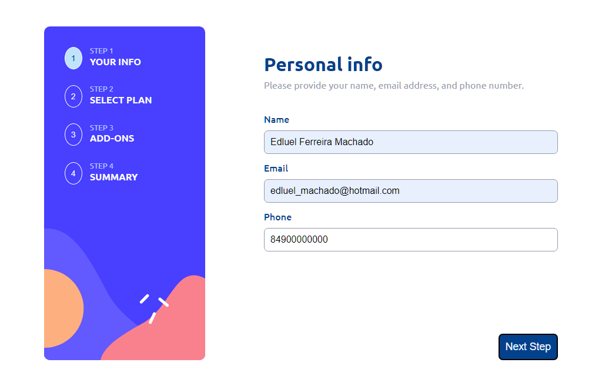

# Multi Step Form

- [Features](#features)
- [Technologies](#technologies)
- [Live Demo](#live-demo)
- [Screenshots](#screenshots)
- [Breakdown](#breakdown)
- [How to Use](#how-to-use)
- [Contributing](#contributing)
- [License](#license)

This is a multi step form built with React and styled with Sass. The form has 4 steps and a sidebar that indicates the current step.

## <a id="features">Features</a>

- Multi-step form with 4 stages for a user-friendly experience
- Personal Info form with email and phone number validation for accurate data collection
- Select Your Plan option with Arcade, Advanced, and Pro plan options and monthly/yearly billing
- Pick Add-ons stage with checkboxes for adding additional features
- Finishing Up stage with a review of the user's selections and a confirmation button for finalizing the purchase
- Clear and concise sidebar to show the user's progress throughout the form
- React and Sass technologies used for efficient and customizable development
- Form data storage using useState hook for easy data management

## <a id="technologies">Technologies Used</a>
- React
- JavaScript
- SASS

## <a id="live-demo">Live demo</a>

Try the live version of the page [here](https://multi-step-form-edluel.vercel.app/)

## <a id="screenshots">Sceenshots</a>

Here are some screenshots of the page clone in action: 

## <a id="breakdown">Breakdown</a>

### Step 1 - Personal Info
This step is where the user fills out their personal information. The form includes validation for email and phone number formats. If the user tries to move to the next step without filling out the form correctly, they will be prompted to fill in or correct the required fields.

### Step 2 - Select Your Plan
This step is where the user selects their plan between Arcade, Advanced, and Pro. They also select the billing type, either monthly or yearly.

### Step 3 - Pick Add-ons
This step is where the user selects any additional features they want to add to their plan using checkboxes.

### Step 4 - Finishing Up
This step shows the options the user has selected so they can review their purchase. The plan display includes a "change" button to go back to Step 2. This step also displays the cost breakdown of each selection and the total cost per month or year depending on the billing type selected. Instead of a "next" button, this step has a "confirm" button that takes the user to a confirmation screen with a thank you message and an email address for support questions.

### More
The sidebar indicating which step the user is on is a component passed in the App component and is loaded directly. Each step is built using a switch and router, meaning each step is a different page path to construct the component.

The form data is stored using a useState hook, where dataForm and setForm are passed as props to the components so they can edit the content stored in the data.

## <a id="how-to-use">How to use it</a>

- Clone the repository
- Open your terminal and navigate to the project directory
- Run npm install to install all the dependencies
- Run npm start to start the development server
- Open http://localhost:3000 to view it in the browser.

## <a id="contributing">Contribute</a>

Feel free to submit pull requests or issues if you have suggestions for improvements. This is a practice project and any feedback is welcome.

## <a id="license">License</a>

This project is lincensed under the MIT license.
